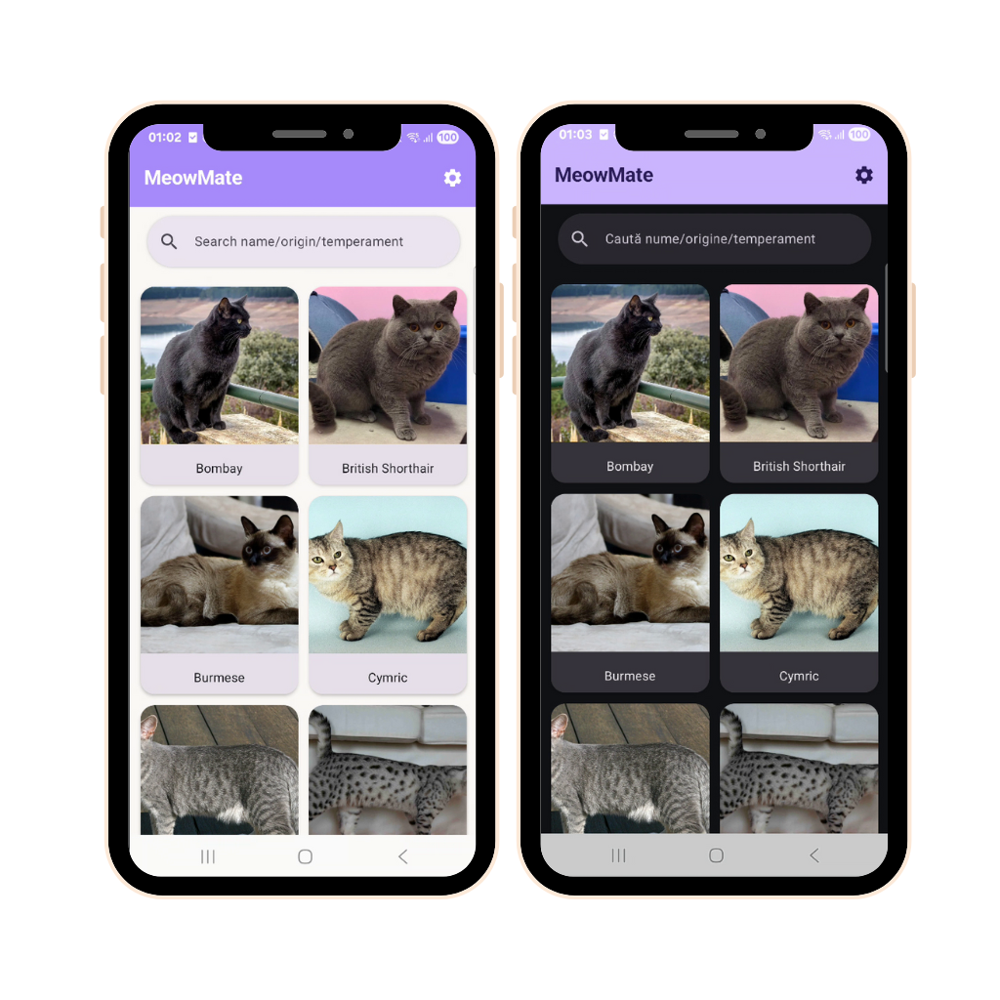
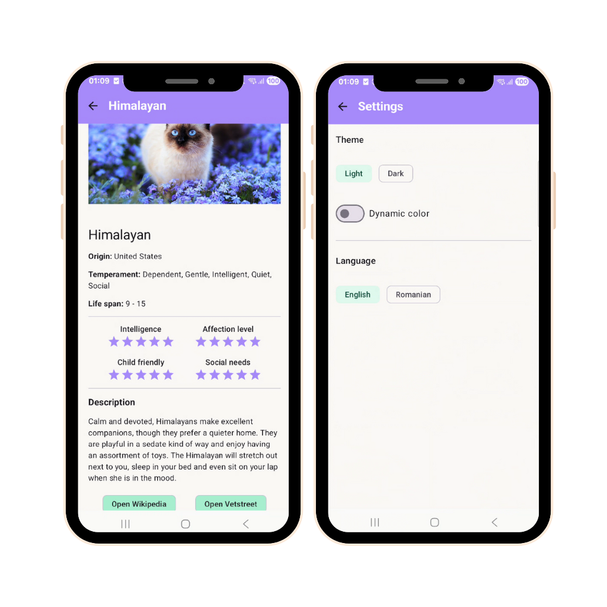

# 🐾 MeowMate
*It’s a modern cat browser app built using **TheCatAPI**, following **Clean Architecture + MVVM**, and powered by **Jetpack Compose**, **Hilt DI**, **Room**, **Retrofit**, and **Material 3**.*

---

## ✨ Overview
**MeowMate** is a modern Android application built with **Kotlin** that lets users explore adorable cats from **TheCatAPI**.  
It features search and filtering, pull-to-refresh, detailed breed information (image, temperament, ratings, description, and external links), offline caching, dynamic language switching (EN/RO/IT), and a Dark/Light theme toggle — all implemented following a modular **Clean Architecture** and **MVVM** pattern.

---

## ✅ Checklist/Progress

### 🧱 Core Architecture
- [x] 🎯 Clean Architecture (modules: `app`, `data`, `domain`)
- [x] 🧠 MVVM pattern (ViewModel, Repository, UseCases)
- [x] 💉 Dependency Injection with Hilt
- [x] 🌐 Retrofit + Moshi + OkHttp (with logging interceptor)
- [x] 💾 Room Database (cache + offline support)
- [x] 🧭 Navigation Compose (list → detail)
- [x] 🧰 BuildConfig API key loaded from `local.properties`

### 🎨 UI/UX
- [x] Material 3 Design (Light & Dark modes)
- [x] Custom App Icon (`ic_launcher`)
- [x] Pull to Refresh (Material3 PullRefresh)
- [x] Zen-style Search Bar (rounded, animated, clear icon)
- [x] Cat List Screen (lazy grid with rounded images)
- [x] Cat Detail Screen (large image + full breed info)
- [x] Breed Data: **name**, **origin**, **temperament**, **life span**
- [x] ⭐ 5-Star ratings (intelligence, affection, child-friendly, social needs)
- [x] 📝 Scrollable description section
- [x] 🌐 Interactive chips → Wikipedia & Vetstreet links
- [x] 💅 Centered layout, rounded corners, clean typography

### 🌍 Accessibility & UX Enhancements
- [x] Runtime language switch (EN/RO)
- [x] Dynamic Dark/Light Theme toggle
- [x] Offline cache fallback (Room)
- [x] Error handling (no internet/bad API response)
- [x] Full internationalization via `strings.xml`

### 🧪 Testing & Maintenance
- [x] Unit tests (repositories, use cases)
- [x] Version catalog (`libs.versions.toml`)
- [x] Modularized project structure
- [x] HttpLoggingInterceptor for debugging
- [x] Gradle setup with Kotlin DSL
- [x] Complete README checklist ✅

---

## 🧭 Features

- 🐱 **Browse cat images** fetched from TheCatAPI
- 🔍 **Search by breed, origin, or temperament
- 🔄 **Pull-to-refresh** using Material 3’s PullRefresh
- 📖 **Detail screen** with large image, breed info, ratings & description
- ⭐ **5-star rating display** (intelligence, affection, child-friendliness, social needs)
- 🌐 **Clickable chips** linking to Wikipedia & Vetstreet pages
- 💾 **Offline caching** with Room database
- 🌍 **Dynamic language switching** (EN/RO)
- 🌙 **Dark/Light theme toggle** with persistent state
- 🚧 **Error handling** for network and API issues  

## Future updates
- Verify star rating functionality 
- Fix images
- Add logging system
- Add loading animation